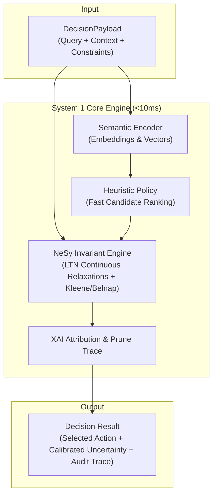

# 1. Architecture Foundations & System 1 Decision Engine

- **Status**: Accepted
- **Date**: 2026-10-01

## Context

Standard LLM-based autonomous agent execution paths rely on heavy autoregressive generation that introduces high latency (hundreds of milliseconds to several seconds), non-deterministic outputs, and lack of rigorous formal constraint verification. For rapid decision-making in autonomous environments, a dedicated "System 1" engine is required: one capable of sub-10ms intuitive heuristic evaluation while remaining grounded by symbolic constraints, calibrated uncertainty, and explainable decision traces.

The project requires a modular, reproducible research environment that benchmarks against existing reference systems (including Jev, Laya, CLM, and Julia-1), supports continuous differentiable neuro-symbolic logic (e.g. Logic Tensor Networks and multi-valued Kleene/Belnap semantics), and integrates cleanly with Python data-science and deep-learning tooling.

## Decision

We establish the foundational architectural pillars and technology choices for Yoda:

1. **System 1 Fast Decision Path**:
   - Deconstruct decision evaluation into rapid semantic encoding followed by lightweight heuristic scoring and constraint checking.
   - Target single-query latency under 10ms for System 1 operations.

2. **Neuro-Symbolic Integration (NeSy) & Uncertainty Quantification**:
   - Couple neural vector representations with hard symbolic invariants.
   - Employ continuous differentiable t-norm relaxations (Product, Łukasiewicz, Gödel) via Logic Tensor Networks (LTN).
   - Use Kleene 3-valued (True, False, Unknown) and Belnap 4-valued (None, Both) logic semantics to distinguish epistemic uncertainty (lack of knowledge) from contradictory ambiguity.

3. **Explainable AI (XAI) & Audit Traces**:
   - Require decision payloads to natively record candidate evaluation traces, constraint satisfaction states, and prune rationales for post-hoc auditing.

4. **Technology Stack**:
   - **Language & Runtime**: Python 3.14 running inside a reproducible Nix environment managed via `devenv`.
   - **Machine Learning & Tensors**: PyTorch 2.x, PyTorch Lightning, Optuna (hyperparameter sweeps), Safetensors (safe weight serialization).
   - **Data & Schemas**: Pydantic v2 (strongly typed domain payloads), Polars (high-performance benchmark data frames).
   - **Interactive Prototyping**: Marimo reactive notebooks (`notebooks/workbench.py`).
   - **Task Automation**: `justfile` with composite recipes (`check`, `workbench`, `clean`, `check-rules`).
   - **Versioning**: Calendar Versioning (CalVer) following PEP 440 (`YYYY.MM.MICRO`).

*System 1 inference flow: semantic representation and heuristic scoring grounded by neuro-symbolic invariant evaluation and native attribution auditing.*

## Consequences

- **Sub-10ms SLA**: Architecture must remain lightweight; heavy autoregressive models are excluded from the hot execution loop.
- **Fail-Safe Operation**: Hard constraint violations produce audited safe fallback states rather than unhandled runtime exceptions.
- **Reproducibility**: `devenv` guarantees identical system packages, Nix libraries, and Python dependencies across developer and CI environments.
- **Comparative Benchmarking**: Benchmark suites evaluate decision agreement, latency, and throughput against baselines including Jev and Laya.
