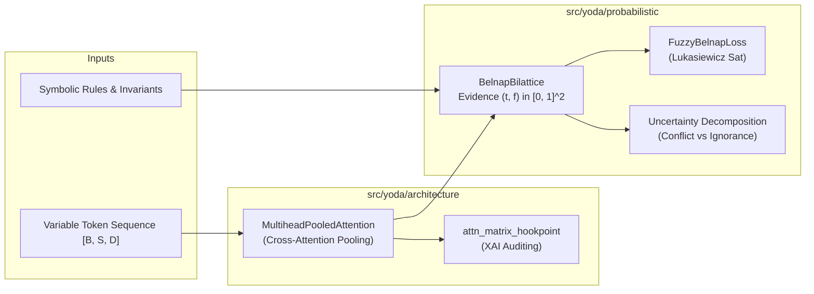

# 2. Core Building Blocks: Multihead Pooled Attention and Fuzzy Belnap Bilattice

- **Status**: Accepted
- **Date**: 2026-10-01

## Context

Yoda is designed as an ultra-fast System 1 decision engine executing low-latency heuristic evaluations while maintaining strict neuro-symbolic constraints and calibrated epistemic uncertainty. To build the core architecture, we require two foundational primitives proven in preceding projects:
1. **Sequence Compression & Feature Pooling**: Ingesting variable-length multi-modal or time-series context into fixed latent representation vectors without destroying multi-head relational alignments (from `attention_matrix_xai_workbench`).
2. **Continuous Differentiable Logic & Contradiction Handling**: Evaluating rule constraints and uncertainty without discrete combinatorial solvers. Standard Boolean or single-axis probabilistic scores force total probability ($P(A) + P(\neg A) = 1$), which conflates conflicting evidence with complete ignorance. A bilattice representation separates positive truth evidence from negative falsity evidence (from `symbolic_nn_tests`).

## Decision

We incorporate two primary architectural building blocks:

1. **`MultiheadPooledAttention`** (`src/yoda/architecture/attention.py`):
   - Uses learnable latent query tokens $Q \in \mathbb{R}^{B \times N_q \times D}$ cross-attending to variable-length input sequences $X \in \mathbb{R}^{B \times S \times D}$.
   - Exposes an explicit attention hookpoint (`self.attn_matrix_hookpoint`) for XAI attribution and decision auditing.
   - Provides an extensible activation registry for attention matrix modulation.

2. **`BelnapBilattice` & `FuzzyBelnapLoss`** (`src/yoda/probabilistic/belnap.py`):
   - Represents truth values as dual-axis continuous evidence pairs $(t, f) \in [0, 1] \times [0, 1]$.
   - Supports 4 canonical states: True $(1, 0)$, False $(0, 1)$, Both/Contradiction $(1, 1)$, and Neither/Ignorance $(0, 0)$.
   - Implements truth ordering operations (meet $\wedge_t$, join $\vee_t$, negation $\neg$) and knowledge ordering operations (consensus $\wedge_k$, gullibility $\vee_k$).
   - Provides continuous Łukasiewicz bi-implication for smooth gradient-based semantic constraint loss.
   - Decomposes uncertainty into orthogonal metrics: conflict, ignorance, total information mass, and polarity.

*Continuous semantic context aggregation via Multihead Pooled Attention feeding dual-axis Belnap bilattice constraint verification.*

## Consequences

- **Positive**: Sequence aggregation is bounded and fixed-dimensional, compatible with downstream low-latency decision heads.
- **Positive**: Decisions can explicitly distinguish between "no evidence" (ignorance $(0, 0)$) and "contradictory evidence" (conflict $(1, 1)$), preventing confident hallucinations on out-of-distribution inputs.
- **Positive**: Smooth, continuous gradients enable end-to-end backpropagation without discrete SAT solvers.
- **Trade-off**: Multi-head cross-attention introduces projection weights and compute scaling with sequence length $S$ and query count $N_q$.
- **Follow-up**: SoftExp activation was evaluated as a potential building block for transformer layers; analysis indicates high numerical instability risk in deep stacks, so standard SwiGLU / GELU activations are preferred, with SoftExp retained only as an optional experiment.
