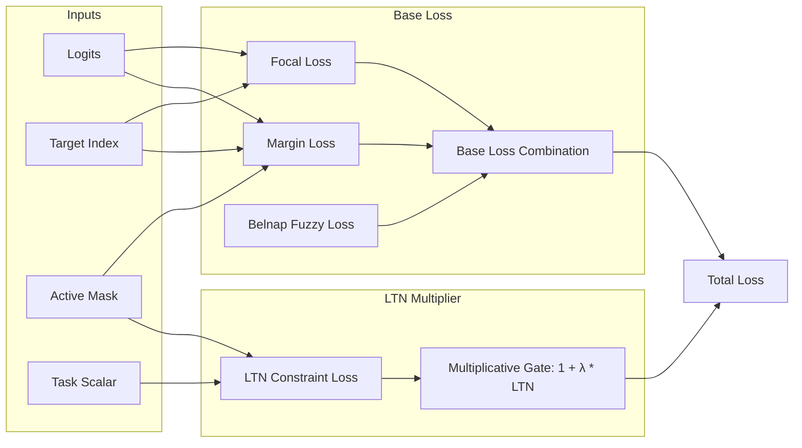

# 12. Focal-Margin Loss Hybrid and OneCycleLR Annealing

- **Status**: Accepted
- **Date**: 2026-10-02

## Context

Initial validation training on processed datasets demonstrated plateaus in loss (~1.18) and accuracy (~35%). Analysis of the training regime identified three key factors:

1. **Cross-Entropy Saturation on Epistemic States**: Standard Cross-Entropy loss penalizes differences by pushing correct logits to $+\infty$ and incorrect logits to $-\infty$. However, Yoda's logits originate from bounded Belnap epistemic evidence ($t, k \in [0, 1]$). Forcing infinite separation leads to saturated sigmoids and vanishing gradients. Furthermore, CE spends gradient capacity penalizing easy negatives (e.g., padded or distant criteria) rather than focusing on ambiguous candidates.
2. **Static Learning Rate**: Without learning rate annealing, the AdamW optimizer bounces around minima in the multi-objective loss landscape rather than settling into a sharp optimum.
3. **LTN Constraint Gating vs. Reward Hacking**: In prior experiments, purely additive logic constraints allowed the model to accept constraint penalties whenever CE reward was sufficiently high (reward hacking). Multiplicative constraint scaling $(1.0 + \lambda_{\text{ltn}} \cdot \mathcal{L}_{\text{ltn}})$ was established as a hard gate to penalize violations proportionally.

## Decision

We introduce a hybrid loss formulation and dynamic learning rate schedule:

1. **Categorical Focal Loss**: Replace standard Cross-Entropy with Focal Loss:
   $$\mathcal{L}_{\text{focal}} = -(1 - p_t)^\gamma \log(p_t)$$
   where $\gamma = 2.0$, downweighting easy negatives and focusing gradients on borderline criteria.
2. **Active-Mask-Aware Margin Loss**: Introduce a margin ranking loss:
   $$\mathcal{L}_{\text{margin}} = \frac{1}{|A| - 1} \sum_{j \in A, j \ne y} \max(0, m - (z_y - z_j))$$
   with margin $m = 0.2$, enforcing a distinct separation threshold between the target choice $z_y$ and active competing choices $z_j$ without requiring infinite logit divergence.
3. **Preserved Multiplicative LTN Gating**: Retain the multiplicative constraint formula:
   $$\mathcal{L}_{\text{base}} = \mathcal{L}_{\text{focal}} + \lambda_{\text{margin}} \mathcal{L}_{\text{margin}} + \lambda_{\text{belnap}} \mathcal{L}_{\text{belnap}}$$
   $$\mathcal{L}_{\text{total}} = \mathcal{L}_{\text{base}} \cdot (1.0 + \lambda_{\text{ltn}} \mathcal{L}_{\text{ltn}})$$
4. **OneCycleLR Annealing**: Implement `OneCycleLR` scheduler in both `YodaTrainer` and `YodaLightningAdapter`, annealing learning rate and momentum over training batches to facilitate super-convergence.

## Consequences

- Gradients focus heavily on ambiguous candidate criteria rather than padding or obvious rejections.
- Sigmoid saturation in the epistemic decision head is mitigated via bounded margin enforcement.
- Model avoids reward hacking on logic invariants while benefiting from fast convergence via OneCycle learning rate cycles.
- Backward compatibility is maintained in telemetry and metric dicts.
