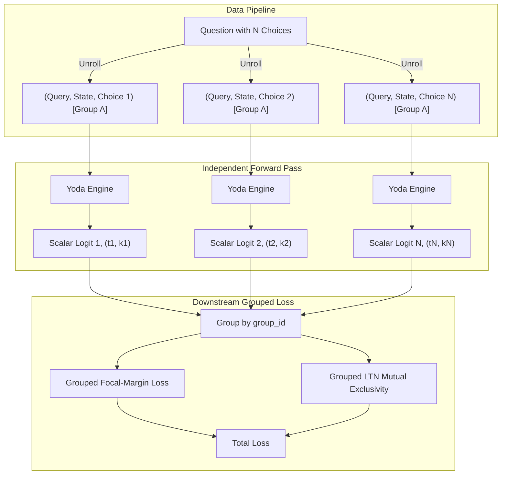

# 13. Independent Choice Assessment Architecture

- **Status**: Accepted
- **Date**: 2026-10-02

## Context

In earlier iterations of Yoda, multiple-choice decisions were handled by padding candidate choices to a fixed `max_choices` tensor dimension (e.g. 5 choices) and utilizing an `active_mask` to mask padded slots with $-10^9$ logits. While functional, this design suffered from several architectural drawbacks:
1. **Masking Overhead & Numerical Sensitivity**: Padded candidates required elaborate boolean mask propagation through decision heads, diagnostics, focal losses, margin losses, and LTN constraint calculations. Very large negative logits ($-10^9$) risked numerical instability in exponential calculations.
2. **Distractor Elimination Bias**: Evaluating choices simultaneously in a single forward pass allows the network to exploit relative comparison and elimination heuristics between distractors, rather than evaluating the absolute epistemic validity of a single choice given a state.
3. **Inflexible Candidate Arity**: The network had a static ceiling on the number of choices and could not dynamically scale to evaluate arbitrary numbers of candidate choices (e.g. 2 choices or 20,000 criteria).

## Decision

We pivot the core decision engine and data pipeline to an **Independent Choice Assessment** paradigm:

1. **Unrolled Dataset & Group Tracking**:
   - `YodaDecisionDataset` unrolls each question into $N$ separate `(query, state, candidate)` triplets with binary target labels (1.0 for correct choice, 0.0 for distractors).
   - Each sample retains a `group_id` (question identifier) mapping it to its parent query group.
   - `collate_decision_batch` collates flat batches containing `group_ids: torch.Tensor` of shape `(batch_size,)`.

2. **Single-Candidate Decision Engine**:
   - `YodaDecisionEngine.forward()` accepts `candidates: list[str]` of shape `(batch_size,)` directly.
   - `ConstraintEncoder` encodes single candidate strings without nested padding.
   - `BelnapDecisionHead` projects pooled evidence to scalar logits, truth, and knowledge coordinates of shape `(batch_size, 1)` or `(batch_size,)`.
   - `active_mask` is completely removed from the forward pass.

3. **Grouped Loss & Downstream Constraint Enforcement**:
   - Downstream categorical constraints (Softmax Cross-Entropy, Focal Loss, Margin Loss, and LTN mutual exclusivity) are applied by grouping outputs by `group_id`.
   - Within each group, competing candidate logits are evaluated against the ground-truth choice.
   - LTN XOR constraints (mutual exclusivity) are calculated across all candidates sharing the same `group_id`.

## Consequences

- **Arbitrary Arity**: The model can evaluate any number of choices dynamically without code changes or padding limits.
- **Pure Epistemic Grounding**: Evaluates the absolute truth ($t$) and knowledge ($k$) of a choice given context, preventing distractor artifacts.
- **Simplified Engine**: Eradicates all `active_mask` and `-1e9` masking logic from the model architecture and DLA diagnostics.
- **Supersedes**: ADR-0011 (Active Criteria Masking) is superseded by this architecture.
